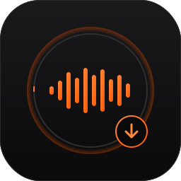

# SoundCloud → AIFF / WAV

<p align="center">
  
</p>

Petit outil **local** pour télécharger des morceaux SoundCloud en haute qualité (AIFF ou WAV PCM 16 bits) avec **pochette intégrée** et **nom de fichier propre**, à des fins de **bibliothèque musicale personnelle**.

Une mini-page web s'ouvre sur `http://localhost:8765`, on colle un lien SoundCloud, on choisit AIFF ou WAV, et le fichier atterrit dans `~/Downloads/SoundCloud/`.

---

## 🚫 Charte d'utilisation

Cet outil est destiné **exclusivement à un usage personnel et privé** : se constituer une bibliothèque musicale chez soi. Il est **interdit** d'utiliser les fichiers produits :

- ❌ en **boîte de nuit, club, bar, festival**,
- ❌ dans un **set DJ public**, en livestream, en radio,
- ❌ dans toute **diffusion publique, payante ou commerciale**,
- ❌ pour les **redistribuer** (mise en ligne, partage, revente).

Pour mixer en public, utilisez les plateformes pro (Beatport, Bandcamp, promos labels, etc.) qui rémunèrent les artistes — c'est la seule manière correcte de soutenir la scène.

---

## ⚠️ Usage strictement local — interdiction d'héberger sur Internet

Ce projet est conçu pour tourner **uniquement sur la machine de l'utilisateur**, sur `127.0.0.1`. Il n'est **pas** prévu, **pas** autorisé et **pas** pensé pour être :

- déployé sur un serveur public,
- hébergé en ligne (VPS, conteneur public, plateforme SaaS, etc.),
- exposé via un tunnel (ngrok, Cloudflare Tunnel, etc.),
- proposé en service à des tiers.

Pourquoi :

- **Légal / droit d'auteur** : télécharger des morceaux SoundCloud peut violer leurs CGU et le droit d'auteur selon votre juridiction. Cet outil est un **usage personnel et privé**, à utiliser uniquement pour des morceaux que vous avez le droit de récupérer (vos propres uploads, contenu sous licence libre, ou usage privé autorisé localement).
- **Sécurité** : le serveur HTTP local est minimaliste, sans authentification ni rate limiting. Le rendre accessible depuis Internet l'exposerait à des abus immédiats.

**Si vous forkez ce dépôt, vous devez conserver cette restriction.** Toute mise en ligne publique ou commerciale est explicitement non autorisée.

---

## À quoi ça sert concrètement

Quand on prépare un set DJ, on a besoin de fichiers :

- **non compressés** (AIFF / WAV) pour conserver la dynamique,
- **bien nommés** (titre clair, sans préfixe « Première : » ou autre bruit),
- **avec la pochette intégrée** dans le tag ID3, pour que le morceau s'affiche correctement dans la bibliothèque du logiciel.

C'est ce que fait l'outil, en une seule étape.

---

## Prérequis

- macOS / Linux (testé sur macOS)
- Python 3.9+
- [`yt-dlp`](https://github.com/yt-dlp/yt-dlp) et [`ffmpeg`](https://ffmpeg.org/) dans le `PATH`

Sur macOS :

```bash
brew install yt-dlp ffmpeg
```

---

## Lancer l'outil

```bash
python3 app.py
```

Puis ouvrir [http://localhost:8765](http://localhost:8765) dans le navigateur.

Les fichiers sont écrits dans `~/Downloads/SoundCloud/`.

---

## Comment ça marche

1. **Aperçu** : `yt-dlp --no-download` récupère titre, artiste et URL de pochette → affichés dans l'interface.
2. **Téléchargement** : `yt-dlp -f bestaudio --write-thumbnail` télécharge le meilleur audio disponible + la pochette en JPG dans un dossier temporaire.
3. **Conversion** : `ffmpeg` ré-encode en PCM 16 bits (AIFF big-endian ou WAV little-endian) et intègre la pochette comme `attached_pic` (tag ID3 APIC).
4. **Progression** : la sortie de `yt-dlp` est lue ligne par ligne et renvoyée au navigateur via Server-Sent Events.

Le tout en ~250 lignes de Python sans dépendance externe au-delà de `yt-dlp` et `ffmpeg`.

---

## Structure

```
.
├── app.py        # serveur HTTP + logique yt-dlp / ffmpeg
├── index.html    # interface web (vanille, sans framework)
└── README.md
```

---

## Licence

Code fourni à titre personnel et éducatif. Aucune garantie. À utiliser dans le respect du droit applicable et des conditions d'utilisation des plateformes concernées.
